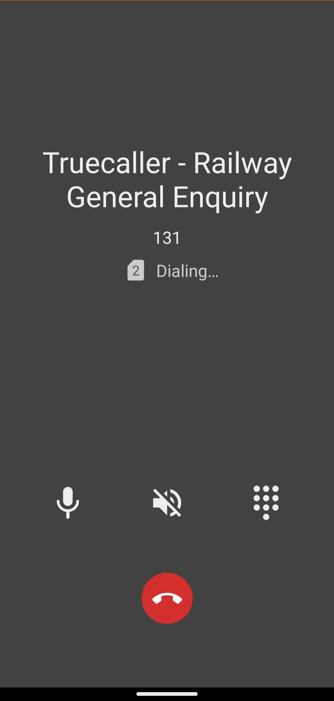
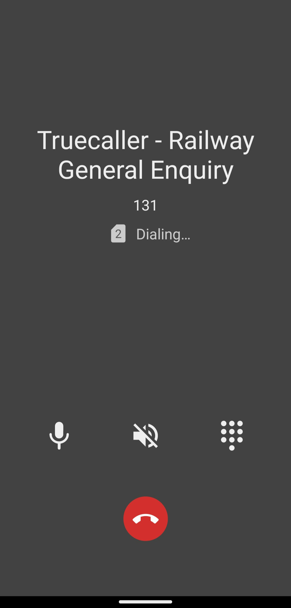

# Simple Dialer


A lightweight app for handling your calls, no matter where are you. Comes with a handy call log for easy call initiation.

There is a quick dialpad at your service too, with smart contact suggestions. It supports letters too.

You can easily block phone numbers to avoid unwanted incoming calls.

Supported Speed dialing makes calling your favorite contacts with this true phone a breeze.

It comes with material design and dark theme by default, provides great user experience for easy usage.
###### It uses internet only when using truecaller api to fetch caller details. Use of truecaller to fetch details is completely optional. App works perfectly well without internet too.

Contains no ads or unnecessary permissions. It is fully opensource, provides customizable colors.

<b>Check out the full suite of Simple Tools here:</b>
https://www.simplemobiletools.com

<b>Facebook:</b>
https://www.facebook.com/simplemobiletools

<b>Reddit:</b>
https://www.reddit.com/r/SimpleMobileTools

<a href='https://play.google.com/store/apps/details?id=com.simplemobiletools.dialer'></a>
<a href='https://f-droid.org/packages/com.simplemobiletools.dialer'></a>

<div style="display:flex;">


</div>

### Getting Truecaller auth token

(Tested with truecaller app version - 11.81.7)

Go to Truecaller app settings -> Privacy Center -> Download my data
Download the json file and open it.

Token is the value of key "id". It will look similar to -
```` 
a1i01--TQkyvDkO-VW8akLyvbyPBFxr11Fi_KOD1Sv1RGv7UPMJV-KU9C62xo4nd
```` 


Input this auth token in Simple Dialer app.
Settings -> Truecaller Auth Token

Once token is added, in subsequent calls(incoming/outgoing), simple dialer will make truecaller api call and display the name of the caller.

<div style="display:flex;">


</div>
